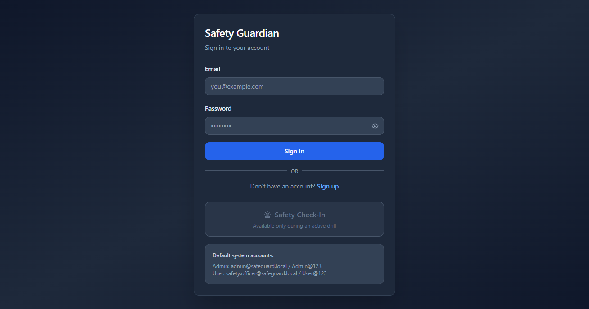
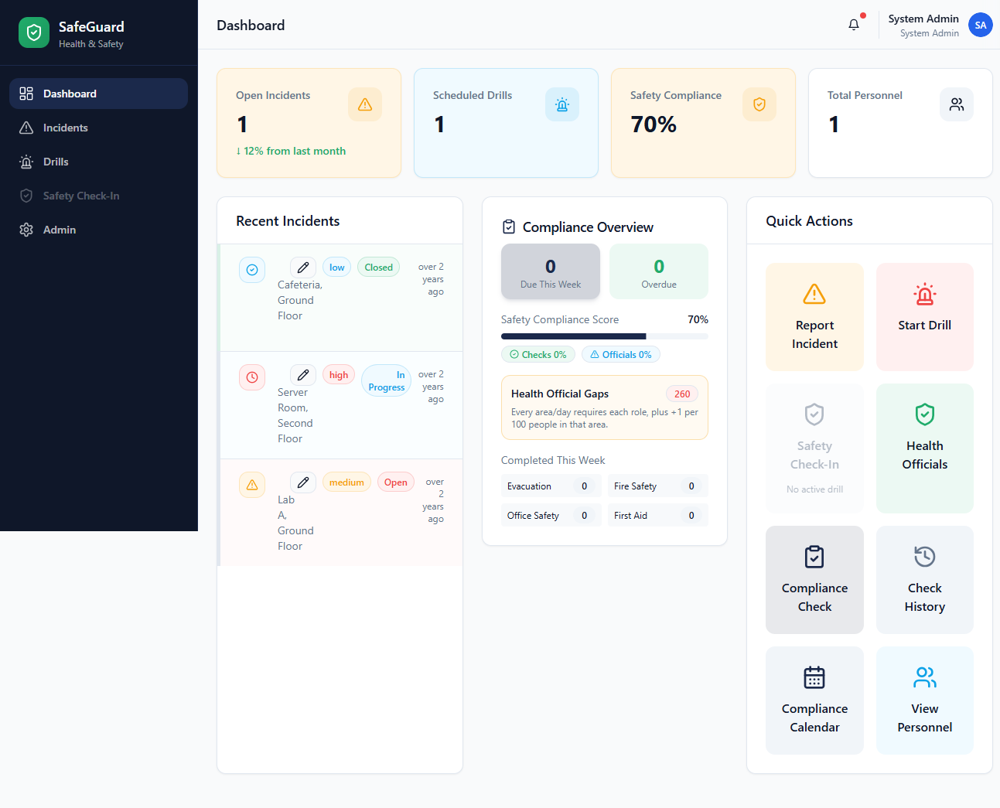
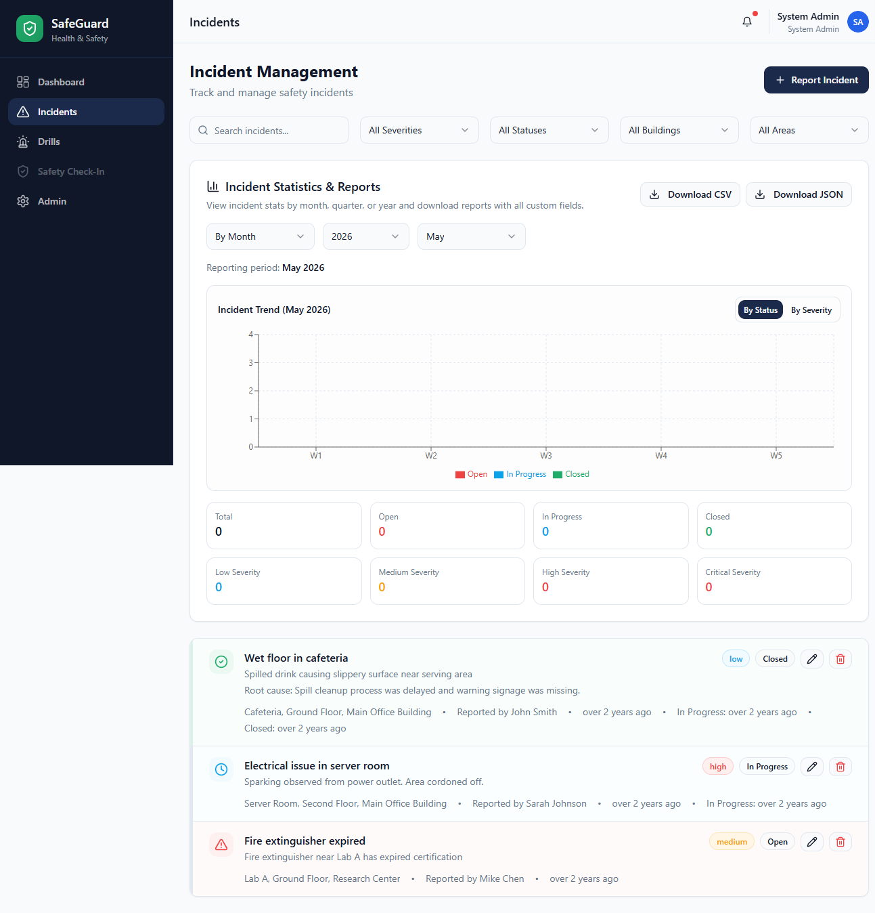
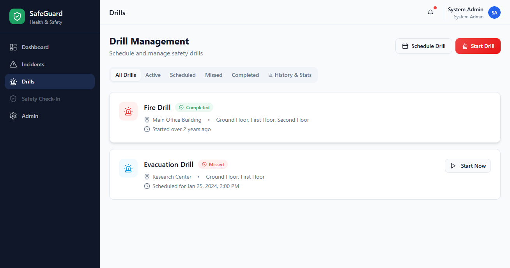
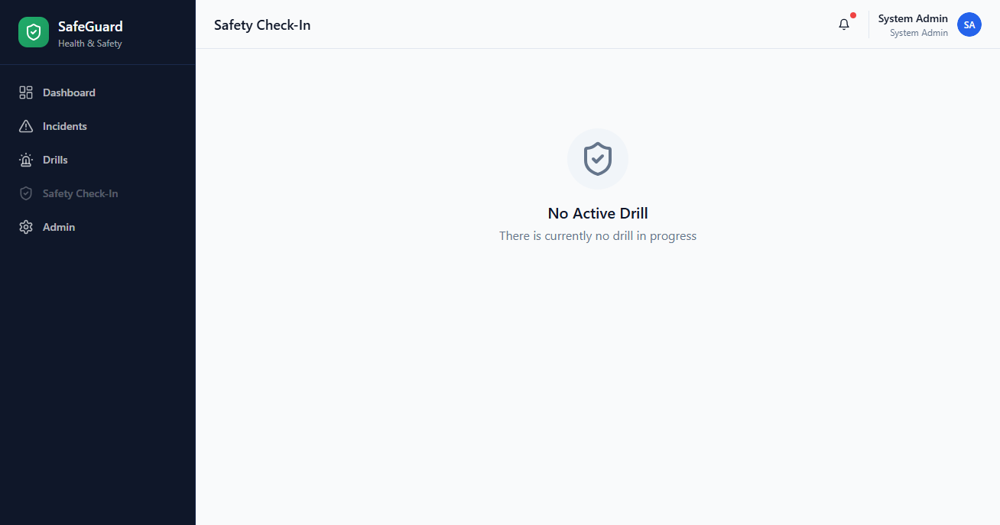
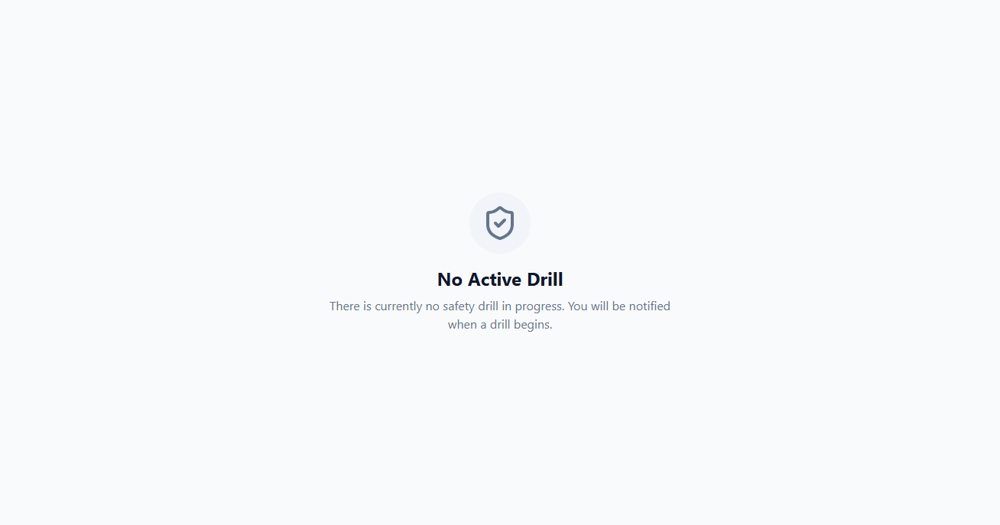

# Safety Guardian Pro User Guide

This guide explains how to use Safety Guardian Pro day to day, with screenshots of the live application.

## Documentation map

- Quick start: [QUICK_START.md](./QUICK_START.md)
- Admin manual: [roles/ADMIN_MANUAL.md](./roles/ADMIN_MANUAL.md)
- Safety officer manual: [roles/SAFETY_OFFICER_MANUAL.md](./roles/SAFETY_OFFICER_MANUAL.md)
- Staff manual: [roles/STAFF_MANUAL.md](./roles/STAFF_MANUAL.md)
- Annotated screenshots: [annotated/README.md](./annotated/README.md)
- Print/PDF pack: [print/PDF_PRINT_GUIDE.md](./print/PDF_PRINT_GUIDE.md)

## Terminology standard

Use the following terms consistently across product docs, UI copy, and reports:

- Overdue Checks: non-training compliance checks that are past due.
- Overdue Training: training assignments that are past due.
- Training Not Done: completed training outcome that was marked not done (penalized separately from overdue checks).
- Missed/Incomplete Checks: checks logged as missed/incomplete after due date processing.

Preferred UI action labels:

- View Overdue Checks
- View Overdue Training

Avoid ambiguous combined labels such as "Overdue Checks And Training" unless a screen intentionally shows both categories together.

## Who this guide is for

- Safety officers managing incidents and drills
- Team leads monitoring check-ins
- Administrators managing settings, personnel, and logs

## Sign in

Use one of the seeded accounts in development:

- Admin: admin@safeguard.local / Admin@123
- User: safety.officer@safeguard.local / User@123

## Dashboard

The dashboard provides a high-level snapshot:

- Open incidents
- Scheduled drills
- Compliance score
- Total personnel
- Quick actions for common tasks

Compliance items in dashboard workflows are split into separate groups:

- Overdue Checks (non-training compliance checks)
- Overdue Training (training assignments)

From the Safety Compliance Score popup, use separate actions:

- View Overdue Checks
- View Overdue Training

## Incidents

Use the Incidents page to track and manage safety incidents.

Typical workflow:

1. Create a new incident with title, location, severity, and details.
2. Move status through Open, In Progress, and Closed.
3. Use analytics filters (month/quarter/year) to review trends.
4. Export reports as CSV or JSON when needed.

## Drills

Use Drills to schedule, start, monitor, and review emergency drills.

Typical workflow:

1. Select Start Drill for immediate drills.
2. Select Schedule Drill to create upcoming drills.
3. End active drills when complete.
4. Open History and Stats to filter by date range and download CSV/JSON history.

## Staff Check-In

Use Safety Check-In to monitor accountability during active drills.

What you can do:

- Search for staff
- Record safe / needs assistance / pending status
- Review check-in coverage by area or floor

## Admin

Admin is for configuration and governance tasks.

Common admin tasks:

- Manage buildings, floors, and areas
- Manage personnel and permissions
- Configure compliance settings
- Review and download system logs (CSV/JSON)
- Monitor compliance exceptions separately for checks and training

## Public Safety Check-In

The public Safety Check-In route is available from login.

- During an active drill, users can check in from this page.
- When no drill is active, the page clearly indicates check-in is unavailable.

## Recommended daily operating flow

1. Start the day on Dashboard to review open issues.
2. Update and resolve Incidents as they occur.
3. Run scheduled Drills and complete check-ins.
4. Use History and Stats exports for reporting.
5. Use Admin for periodic data and permission maintenance.

## Troubleshooting

- If a page appears stale, refresh the browser to reload current local storage state.
- If check-in is unavailable, verify an active drill exists.
- If exports are empty, clear date filters and retry.

## Notes

- This app currently uses local storage in development mode.
- Data and account state are browser-specific.
