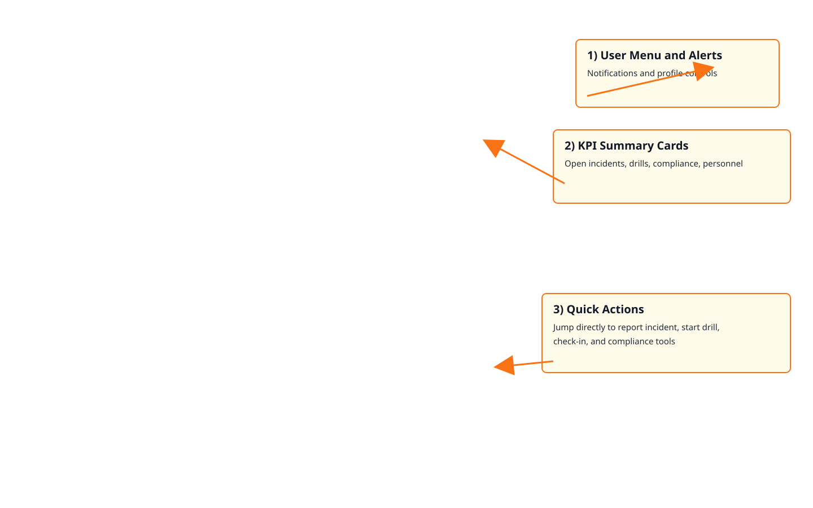
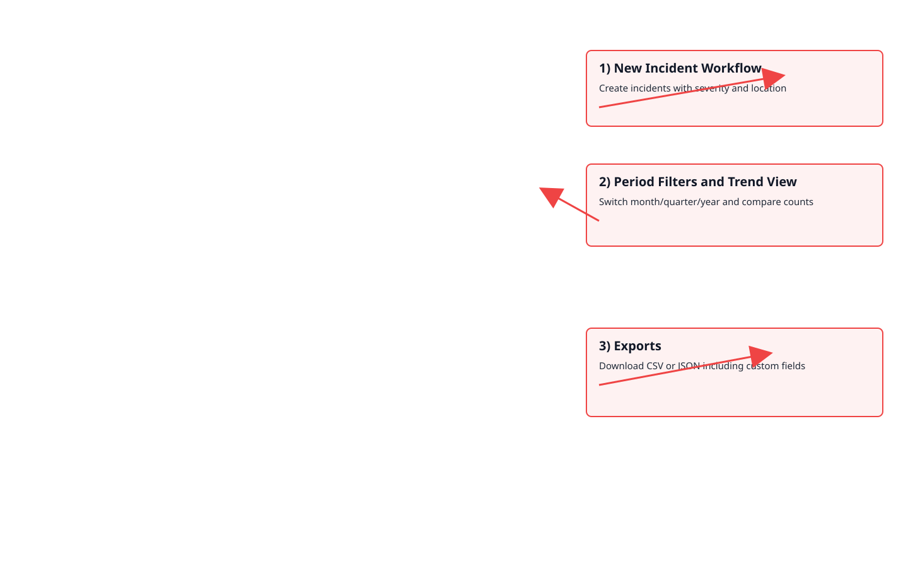
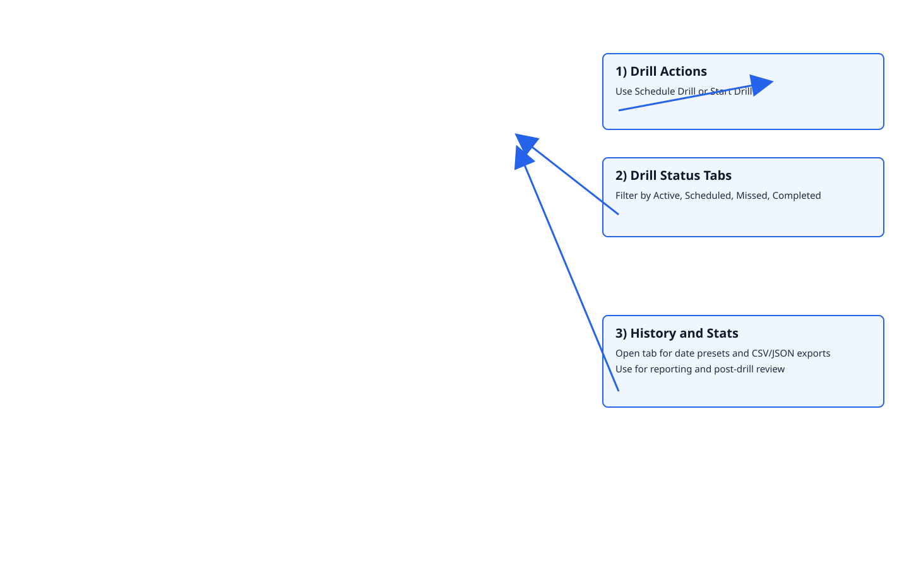
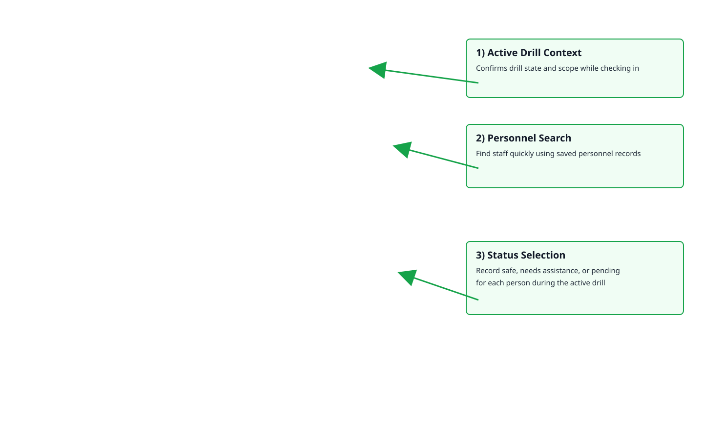

# Annotated Screenshots

These annotated visuals highlight key controls and workflows in each page.

## Dashboard

## Incidents

## Drills

## Safety Check-In

## Notes for trainers

- Use these callouts during onboarding walkthroughs.
- Pair each screenshot with a live demo in the same module.
- Keep this file updated if screen layout changes significantly.
