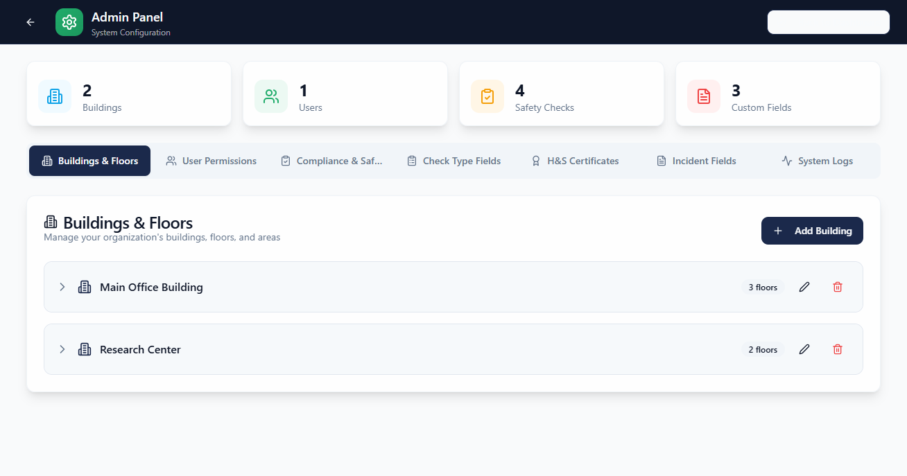

# Safety Guardian Pro Admin Manual

## Purpose

This manual is for platform administrators responsible for setup, governance, and reporting.

## Access level

Admins can access all core modules:

- Dashboard
- Incidents
- Drills
- Safety Check-In
- Admin

## Core responsibilities

- Maintain building, floor, and area structures.
- Manage personnel and role permissions.
- Review system logs and export records.
- Validate compliance and training data quality.
- Support drill readiness and reporting.

## Daily workflow

1. Open Dashboard and review open incidents and compliance score.
2. Review compliance exceptions separately:
	- Overdue Checks (non-training compliance checks)
	- Overdue Training (training assignments)
3. Use the Safety Compliance Score popup actions for targeted follow-up:
	- View Overdue Checks
	- View Overdue Training
4. Check Drills tab for overdue or missed scheduled drills.
5. Verify Safety Check-In readiness for active drill periods.
6. Review Admin logs for unusual access or workflow failures.

## Weekly workflow

1. Export incidents report (CSV/JSON) for weekly review.
2. Export drill history and trend records.
3. Audit personnel permissions by area.
4. Confirm compliance assignments are populated and due dates are valid.

## Key admin tasks

### Manage organization structure

1. Open Admin.
2. Update buildings, floors, and areas.
3. Save and validate visibility in Drill and Check-In pages.

### Manage personnel and permissions

1. Open Admin personnel section.
2. Add or update users.
3. Confirm assignment scope to office, floor, and area.
4. Verify role outcomes by signing in as a standard user (if needed).

### Download system logs

1. Open Admin logs panel.
2. Apply filters (module/date/action).
3. Download CSV for spreadsheet analysis.
4. Download JSON for technical audits or integrations.

## Screenshots

## Common issues and fixes

- Missing users in drill check-in search: validate personnel record has a valid office mapping.
- Empty exports: clear date filters and retry.
- Stale page state: refresh browser to reload local state.
